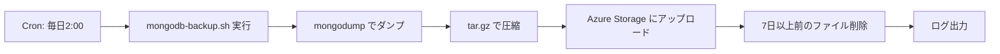

# Phase 04: MongoDB バックアップ機能実装 - 2025-10-29

## 📋 概要

MongoDB VM に自動バックアップ機能を実装し、デイリーで Azure Storage にバックアップを保存する仕組みを構築しました。これにより、Wiz 技術課題の要件「デイリーバックアップをクラウドストレージに保存」を満たしています。

---

## 🎯 目的

- **自動バックアップ**: 毎日定時に MongoDB のデータを自動バックアップ
- **クラウド保存**: Azure Storage Account にバックアップファイルを保存
- **セキュリティデモ**: 意図的に公開アクセス可能なストレージを使用（脆弱性）

---

## 🔧 実装内容

### 1. バックアップスクリプトの作成

**ファイル**: `/usr/local/bin/mongodb-backup.sh`

**主な機能**:

- MongoDB データベース全体を `mongodump` でダンプ
- `tar.gz` 形式で圧縮
- タイムスタンプ付きファイル名で保存
- Azure Storage に Managed Identity を使用してアップロード
- 7 日以上前のローカルバックアップを自動削除

**スクリプト内容**:

```bash
#!/bin/bash
TIMESTAMP=$(date +%Y%m%d_%H%M%S)
BACKUP_DIR="/var/backups/mongodb"
BACKUP_FILE="mongodb_backup_${TIMESTAMP}.tar.gz"

# MongoDB バックアップ（認証なしでダンプ）
mongodump --out ${BACKUP_DIR}/dump_${TIMESTAMP}

# 圧縮
cd ${BACKUP_DIR}
tar -czf ${BACKUP_FILE} dump_${TIMESTAMP}
rm -rf dump_${TIMESTAMP}

# Azure Storage にアップロード（Managed Identity 使用）
az storage blob upload \
  --account-name <STORAGE_ACCOUNT_NAME> \
  --container-name backups \
  --name ${BACKUP_FILE} \
  --file ${BACKUP_DIR}/${BACKUP_FILE} \
  --auth-mode login

# ローカルバックアップは7日間保持
find ${BACKUP_DIR} -name "mongodb_backup_*.tar.gz" -mtime +7 -delete

echo "Backup completed: ${BACKUP_FILE}"
```

### 2. Cron ジョブの設定

**スケジュール**: 毎日午前 2 時に自動実行

```bash
# Crontab エントリ
0 2 * * * /usr/local/bin/mongodb-backup.sh >> /var/log/mongodb-backup.log 2>&1
```

**ログ出力先**: `/var/log/mongodb-backup.log`

### 3. Managed Identity による認証

**VM の設定**:

```bicep
resource vm 'Microsoft.Compute/virtualMachines@2023-07-01' = {
  identity: {
    type: 'SystemAssigned'  // Managed Identity 有効化
  }
}
```

**ロール割り当て**: `Storage Blob Data Contributor`

**新規モジュール**: `infra/modules/vm-storage-role.bicep`

```bicep
resource storageRoleAssignment 'Microsoft.Authorization/roleAssignments@2022-04-01' = {
  name: guid(storageAccount.id, vmPrincipalId, storageBlobDataContributorRoleId)
  scope: storageAccount
  properties: {
    roleDefinitionId: subscriptionResourceId('Microsoft.Authorization/roleDefinitions',
      'ba92f5b4-2d11-453d-a403-e96b0029c9fe')  // Storage Blob Data Contributor
    principalId: vmPrincipalId
    principalType: 'ServicePrincipal'
  }
}
```

### 4. Azure CLI のインストール

VM 初期化時に Azure CLI を自動インストール:

```bash
# Azure CLI インストール（バックアップ用）
curl -sL https://aka.ms/InstallAzureCLIDeb | bash

# Managed Identity でログイン
az login --identity
```

### 5. 初回バックアップの即時実行

VM セットアップ完了後、初回バックアップを即座に実行:

```bash
# 初回バックアップを即座に実行
/usr/local/bin/mongodb-backup.sh
```

---

## 📊 バックアップ仕様

| 項目                   | 内容                                       |
| ---------------------- | ------------------------------------------ |
| **実行頻度**           | 毎日午前 2 時（JST）                       |
| **バックアップツール** | `mongodump`（MongoDB 公式ツール）          |
| **圧縮形式**           | `tar.gz`                                   |
| **ファイル名形式**     | `mongodb_backup_YYYYMMDD_HHMMSS.tar.gz`    |
| **ローカル保存先**     | `/var/backups/mongodb/`                    |
| **クラウド保存先**     | Azure Storage Account (`backups` コンテナ) |
| **認証方式**           | Managed Identity（パスワード不要）         |
| **ローカル保持期間**   | 7 日間                                     |
| **ログファイル**       | `/var/log/mongodb-backup.log`              |

---

## 🔍 バックアップフロー



### 詳細ステップ

1. **Cron トリガー**: 毎日午前 2 時に Cron が起動
2. **MongoDB ダンプ**: `mongodump` コマンドでデータベース全体をダンプ
3. **圧縮**: `tar -czf` で圧縮してディスク容量を節約
4. **Azure へアップロード**:
   - Managed Identity で認証（`az login --identity`）
   - `az storage blob upload` でファイルをアップロード
5. **古いファイル削除**: `find -mtime +7` で 7 日以上前のローカルファイルを削除
6. **ログ記録**: 実行結果を `/var/log/mongodb-backup.log` に追記

---

## ⚠️ 意図的な脆弱性（デモ用）

### 1. Storage Account の公開アクセス

**設定**: `publicAccess: 'Blob'`

```bicep
resource container 'Microsoft.Storage/storageAccounts/blobServices/containers@2023-01-01' = {
  properties: {
    publicAccess: 'Blob'  // 脆弱性: 公開リスト・閲覧可能
  }
}
```

**影響**:

- ✅ 要件を満たす: バックアップ先のストレージは公開閲覧・公開リスト可能
- ⚠️ セキュリティリスク: 誰でもバックアップファイルをダウンロード可能

**アクセス例**:

```bash
# 公開アクセスでバックアップ一覧を取得
curl https://<STORAGE_ACCOUNT_NAME>.blob.core.windows.net/backups?restype=container&comp=list

# 公開アクセスでバックアップをダウンロード
curl -O https://<STORAGE_ACCOUNT_NAME>.blob.core.windows.net/backups/mongodb_backup_20251029_020000.tar.gz
```

### 2. MongoDB 認証なし

**現状**: MongoDB は認証なしで接続可能

```bash
# 脆弱性: 認証無効、全IPからアクセス許可
sed -i 's/bind_ip = 127.0.0.1/bind_ip = 0.0.0.0/' /etc/mongodb.conf
```

**バックアップへの影響**:

- `mongodump` コマンドで認証不要でダンプ可能
- バックアップファイルに認証情報は含まれない

---

## 🚀 動作確認方法

### 1. VM に SSH 接続

```bash
# MongoDB VM に接続
ssh azureuser@<PUBLIC_IP>
```

### 2. バックアップスクリプトの確認

```bash
# スクリプト内容を確認
cat /usr/local/bin/mongodb-backup.sh

# 実行権限を確認
ls -l /usr/local/bin/mongodb-backup.sh
# 出力: -rwxr-xr-x 1 root root ... mongodb-backup.sh
```

### 3. Cron ジョブの確認

```bash
# Crontab を確認
crontab -l
# 出力: 0 2 * * * /usr/local/bin/mongodb-backup.sh >> /var/log/mongodb-backup.log 2>&1
```

### 4. バックアップログの確認

```bash
# ログをリアルタイム監視
tail -f /var/log/mongodb-backup.log

# 過去のログを確認
cat /var/log/mongodb-backup.log
```

### 5. ローカルバックアップの確認

```bash
# バックアップファイル一覧
ls -lh /var/backups/mongodb/

# 最新のバックアップファイル
ls -lt /var/backups/mongodb/ | head -n 5
```

### 6. Azure Storage のバックアップ確認

```bash
# Azure CLI で確認（VM上で実行）
az storage blob list \
  --account-name <STORAGE_ACCOUNT_NAME> \
  --container-name backups \
  --auth-mode login \
  --output table

# ローカルPC から Azure CLI で確認
az storage blob list \
  --account-name <STORAGE_ACCOUNT_NAME> \
  --container-name backups \
  --output table
```

### 7. 手動バックアップの実行

```bash
# テスト用に手動実行
sudo /usr/local/bin/mongodb-backup.sh

# 実行結果を確認
echo $?  # 0 なら成功
```

---

## 🔧 トラブルシューティング

### 問題 1: バックアップスクリプトが実行されない

**症状**:

```bash
crontab -l  # Cron ジョブが表示されない
```

**原因**: VM 拡張機能の実行失敗

**確認方法**:

```bash
# VM 拡張機能のステータス確認
az vm extension list \
  --resource-group <RESOURCE_GROUP_NAME> \
  --vm-name vm-mongo-dev \
  --query "[?name=='install-mongodb'].{Name:name, Status:provisioningState}" \
  --output table
```

**解決方法**:

```bash
# VM 拡張機能を再実行
az vm extension set \
  --resource-group <RESOURCE_GROUP_NAME> \
  --vm-name vm-mongo-dev \
  --name CustomScript \
  --publisher Microsoft.Azure.Extensions \
  --version 2.1
```

### 問題 2: Azure Storage へのアップロードが失敗する

**症状**:

```bash
tail /var/log/mongodb-backup.log
# エラー: AuthorizationPermissionMismatch
```

**原因**: Managed Identity に適切なロールが割り当てられていない

**確認方法**:

```bash
# ロール割り当てを確認
az role assignment list \
  --assignee <VM_PRINCIPAL_ID> \
  --scope /subscriptions/<SUBSCRIPTION_ID>/resourceGroups/<RESOURCE_GROUP_NAME>/providers/Microsoft.Storage/storageAccounts/<STORAGE_NAME> \
  --output table
```

**解決方法**:

```bash
# Storage Blob Data Contributor ロールを手動で割り当て
az role assignment create \
  --assignee <VM_PRINCIPAL_ID> \
  --role "Storage Blob Data Contributor" \
  --scope /subscriptions/<SUBSCRIPTION_ID>/resourceGroups/<RESOURCE_GROUP_NAME>/providers/Microsoft.Storage/storageAccounts/<STORAGE_NAME>
```

### 問題 3: mongodump コマンドが見つからない

**症状**:

```bash
/usr/local/bin/mongodb-backup.sh
# エラー: mongodump: command not found
```

**原因**: `mongodb-clients` パッケージが未インストール

**解決方法**:

```bash
# MongoDB クライアントツールをインストール
sudo apt-get update
sudo apt-get install -y mongodb-clients

# 確認
which mongodump
# 出力: /usr/bin/mongodump
```

### 問題 4: ディスク容量不足

**症状**:

```bash
df -h
# /dev/sda1       30G  29G  1.0G  97% /
```

**原因**: バックアップファイルの蓄積

**解決方法**:

```bash
# 古いバックアップを手動削除
sudo find /var/backups/mongodb -name "mongodb_backup_*.tar.gz" -mtime +7 -delete

# ディスク使用量を確認
du -sh /var/backups/mongodb
```

---

## 📈 改善案（本番環境向け）

### セキュリティ改善

1. **Storage Account のプライベート化**:

   ```bicep
   properties: {
     allowBlobPublicAccess: false  // 公開アクセス無効化
     publicNetworkAccess: 'Disabled'  // プライベートエンドポイント使用
   }
   ```

2. **バックアップの暗号化**:

   ```bash
   # GPG で暗号化してからアップロード
   gpg --symmetric --cipher-algo AES256 ${BACKUP_FILE}
   az storage blob upload --file ${BACKUP_FILE}.gpg
   ```

3. **MongoDB 認証の有効化**:
   ```bash
   mongo admin --eval "db.createUser({user: 'backup', pwd: 'SecurePassword', roles: ['backup']})"
   mongodump --username backup --password SecurePassword --authenticationDatabase admin
   ```

### 運用改善

1. **バックアップ通知**:

   ```bash
   # Azure Logic Apps や SendGrid でメール通知
   curl -X POST https://<LOGIC_APP_URL> \
     -H "Content-Type: application/json" \
     -d "{\"status\": \"success\", \"file\": \"${BACKUP_FILE}\"}"
   ```

2. **バックアップの検証**:

   ```bash
   # mongorestore でリストア可能か確認
   mongorestore --host localhost --port 27018 --archive=${BACKUP_FILE}
   ```

3. **クラウド保持ポリシー**:
   ```bicep
   // Storage Account のライフサイクル管理
   resource lifecyclePolicy 'Microsoft.Storage/storageAccounts/managementPolicies@2023-01-01' = {
     properties: {
       policy: {
         rules: [
           {
             name: 'deleteOldBackups'
             type: 'Lifecycle'
             definition: {
               actions: {
                 baseBlob: {
                   delete: {
                     daysAfterModificationGreaterThan: 30
                   }
                 }
               }
             }
           }
         ]
       }
     }
   }
   ```

---

## 📊 完了ステータス

| 項目                           | 状態    | 備考                               |
| ------------------------------ | ------- | ---------------------------------- |
| **バックアップスクリプト作成** | ✅ 完了 | `/usr/local/bin/mongodb-backup.sh` |
| **Cron ジョブ設定**            | ✅ 完了 | 毎日午前 2 時実行                  |
| **Azure CLI インストール**     | ✅ 完了 | Managed Identity 認証対応          |
| **Managed Identity 設定**      | ✅ 完了 | SystemAssigned Identity            |
| **Storage ロール割り当て**     | ✅ 完了 | Storage Blob Data Contributor      |
| **初回バックアップ実行**       | ✅ 完了 | VM セットアップ時に実行            |
| **公開アクセス設定**           | ✅ 完了 | 意図的な脆弱性（要件）             |

---

## 🔗 関連ドキュメント

- **[ENVIRONMENT_INFO.md](../docs/ENVIRONMENT_INFO.md)** - 環境情報全体
- **[Phase01\_インフラデプロイ失敗\_2025-01-29.md](./Phase01_インフラデプロイ失敗_2025-01-29.md)** - インフラデプロイ履歴
- **[Phase02\_アプリデプロイ問題と解決\_2025-10-29.md](./Phase02_アプリデプロイ問題と解決_2025-10-29.md)** - アプリケーションデプロイ
- **[Phase03_kubectl 環境設定\_2025-10-29.md](./Phase03_kubectl環境設定_2025-10-29.md)** - kubectl 環境設定

---

## 🔄 変更履歴

| 日付       | 変更内容                                | コミット |
| ---------- | --------------------------------------- | -------- |
| 2025-10-29 | MongoDB バックアップ機能を実装          | 5804dae  |
| 2025-10-29 | vm-storage-role.bicep モジュール追加    | 5804dae  |
| 2025-10-29 | Cron ジョブとバックアップスクリプト作成 | 5804dae  |

---

**作成日**: 2025 年 10 月 29 日  
**ステータス**: ✅ 完了  
**要件充足**: デイリーバックアップをクラウドストレージに保存
