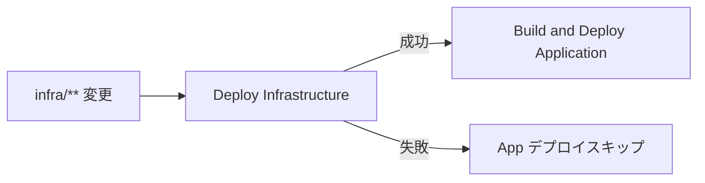
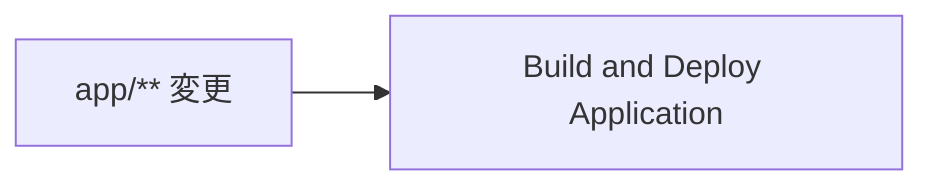

# Phase 06: ワークフロー依存関係実装

**作成日**: 2025-10-29  
**ステータス**: ✅ 解決済み  
**カテゴリ**: CI/CD パイプライン設計

---

## 🤔 課題

Infrastructure（ACR、AKS など）がデプロイされる前に、Application デプロイワークフローが実行されてしまい、以下のエラーが発生:

```
ERROR: Could not connect to the registry login server 'acrwizdev.azurecr.io'.
Please verify that the registry exists.
```

### 問題の原因

1. **独立したトリガー**

   - `infra-deploy.yml`: `infra/**` の変更で実行
   - `app-deploy.yml`: `app/**` の変更で実行
   - 両ワークフローが並行実行される可能性

2. **リソース未作成エラー**

   - ACR が存在しない状態で `az acr login` が失敗
   - AKS が存在しない状態で `kubectl apply` が失敗

3. **手動実行の煩雑さ**
   - Infrastructure デプロイ完了を確認
   - 手動で App デプロイワークフローをトリガー
   - 運用ミスの可能性

---

## ✅ 解決策

### GitHub Actions の `workflow_run` イベント

Infrastructure デプロイが**完了してから**自動的に App デプロイを開始する。

#### 実装コード

**`.github/workflows/app-deploy.yml`**

```yaml
name: Build and Deploy Application

on:
  push:
    branches:
      - main
    paths:
      - "app/**"
      - ".github/workflows/app-deploy.yml"
  workflow_dispatch:
  # ✅ Infrastructure デプロイ完了後に自動実行
  workflow_run:
    workflows: ["Deploy Infrastructure"]
    types:
      - completed
    branches:
      - main

env:
  ACR_NAME: acrwizdev
  IMAGE_NAME: guestbook
  RESOURCE_GROUP: rg-wiz-exercise-a

jobs:
  scan-container:
    name: Scan Container Image
    runs-on: ubuntu-latest
    # ✅ 成功した場合のみ実行（失敗時はスキップ）
    if: ${{ github.event_name != 'workflow_run' || github.event.workflow_run.conclusion == 'success' }}
    steps:
      - name: Checkout Code
        uses: actions/checkout@v4
      # ... 以下省略
```

---

## 🔄 動作フロー

### パターン 1: Infrastructure 変更時



1. `infra/**` ファイルを変更して push
2. `Deploy Infrastructure` ワークフロー実行
3. **成功した場合**: 自動的に `Build and Deploy Application` が実行
4. **失敗した場合**: App デプロイは実行されない

### パターン 2: Application 変更時（従来通り）



1. `app/**` ファイルを変更して push
2. `Build and Deploy Application` ワークフローが直接実行
3. Infrastructure は既にデプロイ済みと想定

### パターン 3: 手動実行（従来通り）

```
GitHub Actions UI → workflow_dispatch → 任意のワークフローを手動実行
```

---

## 📊 実装の詳細

### `workflow_run` トリガーの仕様

| プロパティ  | 説明                       | 設定値                               |
| ----------- | -------------------------- | ------------------------------------ |
| `workflows` | トリガー元のワークフロー名 | `["Deploy Infrastructure"]`          |
| `types`     | 監視するイベント           | `completed` (成功・失敗問わず完了時) |
| `branches`  | 対象ブランチ               | `main`                               |

### 条件分岐 `if` の意味

```yaml
if: ${{ github.event_name != 'workflow_run' || github.event.workflow_run.conclusion == 'success' }}
```

| 条件                                                | 意味                          | 実行        |
| --------------------------------------------------- | ----------------------------- | ----------- |
| `github.event_name != 'workflow_run'`               | 直接トリガー（push/手動実行） | ✅ 実行     |
| `github.event.workflow_run.conclusion == 'success'` | Infrastructure デプロイ成功   | ✅ 実行     |
| `github.event.workflow_run.conclusion == 'failure'` | Infrastructure デプロイ失敗   | ❌ スキップ |

---

## 🎯 メリット

### 1. **自動化の向上**

- Infrastructure デプロイ後、手動実行不要
- 一連の流れが完全自動化

### 2. **エラー削減**

- ACR/AKS が存在しない状態でのデプロイ失敗を防止
- リソース依存関係を明示的に定義

### 3. **運用の簡素化**

- デプロイ順序を意識する必要なし
- GitHub Actions が依存関係を管理

### 4. **柔軟性の維持**

- `app/**` 単独変更時は直接デプロイ可能
- 手動実行も引き続き利用可能

---

## 📝 注意事項

### Infrastructure が既にデプロイ済みの場合

**`app/**` のみ変更した場合:\*\*

- `workflow_run` トリガーは発火しない
- `push` トリガーで直接実行される
- ACR/AKS は既存リソースを使用

### 両方のファイルを同時に変更した場合

**同一コミットで `infra/**`と`app/**` を変更:**

1. `Deploy Infrastructure` が実行される
2. `Build and Deploy Application` も `push` で直接実行される
3. さらに Infrastructure 完了後に再度 App デプロイが実行される

**対策（必要に応じて）:**

- `app/**` の `paths` トリガーを削除し、`workflow_run` のみにする
- または、重複実行を許容する（冪等性があれば問題なし）

---

## 🔍 検証方法

### 1. Infrastructure デプロイのトリガー

```bash
# infra/ 配下のファイルを変更
git add infra/
git commit -m "feat: Update infrastructure"
git push
```

**期待される動作:**

1. `Deploy Infrastructure` ワークフローが開始
2. 完了後、自動的に `Build and Deploy Application` が開始

### 2. GitHub Actions UI での確認

```
Actions タブ → Workflows
├── Deploy Infrastructure (実行中/完了)
└── Build and Deploy Application (待機中 → 実行中)
    └── triggered by: workflow_run (Deploy Infrastructure)
```

---

## 📚 参考資料

- [GitHub Actions: `workflow_run` event](https://docs.github.com/en/actions/using-workflows/events-that-trigger-workflows#workflow_run)
- [Workflow 間の依存関係](https://docs.github.com/en/actions/using-workflows/events-that-trigger-workflows#running-a-workflow-based-on-the-conclusion-of-another-workflow)

---

## 🔄 変更履歴

| 日時       | 変更内容                                      |
| ---------- | --------------------------------------------- |
| 2025-10-29 | 初期実装: `workflow_run` トリガー追加         |
| 2025-10-29 | 条件分岐追加: Infrastructure 失敗時はスキップ |
