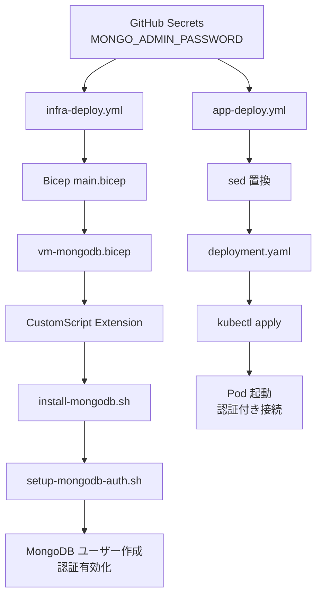

# Phase 17: MongoDB 認証機能追加（2025-10-30）

## 📋 概要

Wiz Technical Exercise の要件「MongoDB は認証を必須化」を満たすため、MongoDB に認証機能を追加し、アプリケーションが認証付きで接続するように実装しました。

---

## 🎯 目的

### 要件

> **MongoDB は認証を必須化**  
> （Wiz Technical Exercise 要件より）

### 実装前の状態

- ❌ MongoDB は認証なし（`security: ` セクションがコメントアウト）
- ❌ 誰でも認証なしでデータベースにアクセス可能
- ❌ アプリも認証なしで接続

### 実装後の目標

- ✅ MongoDB に管理者ユーザーを作成
- ✅ `security.authorization: enabled` で認証を有効化
- ✅ アプリが認証情報を使って接続
- ✅ バックアップも認証付きで実行

---

## 🔧 実装内容

### 1️⃣ MongoDB 認証スクリプト作成

**ファイル**: `infra/scripts/setup-mongodb-auth.sh` (新規作成)

```bash
#!/bin/bash
set -e

echo "=== Setting up MongoDB Authentication ==="

# パラメータから認証情報を取得
MONGO_ADMIN_USER="${MONGO_ADMIN_USER:-mongoadmin}"
MONGO_ADMIN_PASSWORD="${MONGO_ADMIN_PASSWORD}"

if [ -z "$MONGO_ADMIN_PASSWORD" ]; then
  echo "ERROR: MONGO_ADMIN_PASSWORD environment variable is required"
  exit 1
fi

# 管理者ユーザーを作成（認証無効の状態で）
mongo admin --eval "
  db.createUser({
    user: '${MONGO_ADMIN_USER}',
    pwd: '${MONGO_ADMIN_PASSWORD}',
    roles: [
      { role: 'root', db: 'admin' },
      { role: 'userAdminAnyDatabase', db: 'admin' },
      { role: 'dbAdminAnyDatabase', db: 'admin' },
      { role: 'readWriteAnyDatabase', db: 'admin' }
    ]
  })
"

# security セクションに authorization: enabled を追加
if grep -q "^#security:" "$MONGO_CONF"; then
  sed -i 's/^#security:/security:\n  authorization: enabled/' "$MONGO_CONF"
else
  cat >> "$MONGO_CONF" << 'EOF'

# Security Settings
security:
  authorization: enabled
EOF
fi

# MongoDB を再起動
systemctl restart $SERVICE_NAME
```

**機能**:

- MongoDB 管理者ユーザー `mongoadmin` を作成
- パスワードは環境変数 `MONGO_ADMIN_PASSWORD` から取得
- 認証を有効化して MongoDB を再起動

---

### 2️⃣ Bicep テンプレート修正

#### **infra/main.bicep**

```bicep
@description('MongoDB管理者pass')
@secure()
param mongoAdminPassword string

// MongoDB VM (脆弱な構成)
module mongoVM 'modules/vm-mongodb.bicep' = {
  scope: rg
  name: 'mongodb-${deploymentTimestamp}'
  params: {
    location: location
    environment: environment
    adminPassword: mongoAdminPassword
    mongoAdminPassword: mongoAdminPassword  // 追加
    subnetId: networking.outputs.mongoSubnetId
    storageAccountName: storage.outputs.storageAccountName
    backupContainerName: storage.outputs.containerName
    allowSSHFromInternet: true
  }
}
```

#### **infra/modules/vm-mongodb.bicep**

```bicep
@description('MongoDB管理者パスワード')
@secure()
param mongoAdminPassword string

// MongoDB インストールスクリプト（認証付き）
resource vmExtension 'Microsoft.Compute/virtualMachines/extensions@2023-07-01' = {
  parent: vm
  name: 'install-mongodb'
  location: location
  properties: {
    publisher: 'Microsoft.Azure.Extensions'
    type: 'CustomScript'
    typeHandlerVersion: '2.1'
    autoUpgradeMinorVersion: true
    settings: {
      fileUris: [
        'https://raw.githubusercontent.com/aktsmm/wiz-technical-exercise/main/infra/scripts/install-mongodb.sh'
        'https://raw.githubusercontent.com/aktsmm/wiz-technical-exercise/main/infra/scripts/setup-mongodb-auth.sh'
        'https://raw.githubusercontent.com/aktsmm/wiz-technical-exercise/main/infra/scripts/setup-backup.sh'
      ]
    }
    protectedSettings: {
      commandToExecute: 'bash install-mongodb.sh && MONGO_ADMIN_PASSWORD="${mongoAdminPassword}" bash setup-mongodb-auth.sh && MONGO_ADMIN_PASSWORD="${mongoAdminPassword}" bash setup-backup.sh ${storageAccountName} ${backupContainerName}'
    }
  }
}
```

**変更点**:

- `mongoAdminPassword` パラメータを追加
- CustomScript Extension で `setup-mongodb-auth.sh` を実行
- 環境変数 `MONGO_ADMIN_PASSWORD` でパスワードを渡す

---

### 3️⃣ Kubernetes マニフェスト修正

#### **app/k8s/deployment.yaml**

```yaml
env:
  - name: MONGO_URI
    value: "mongodb://mongoadmin:<MONGO_ADMIN_PASSWORD>@<MONGO_VM_IP>:27017/guestbook?authSource=admin"
  - name: PORT
    value: "3000"
```

**変更点**:

- 接続文字列に `mongoadmin:<MONGO_ADMIN_PASSWORD>@` を追加
- `authSource=admin` で認証データベースを指定
- プレースホルダー `<MONGO_ADMIN_PASSWORD>` は CI/CD で置換

---

### 4️⃣ CI/CD ワークフロー修正

#### **.github/workflows/infra-deploy.yml**

```yaml
- name: Deploy Bicep
  uses: azure/arm-deploy@v1
  with:
    subscriptionId: ${{ env.AZURE_SUBSCRIPTION_ID }}
    scope: subscription
    region: ${{ env.LOCATION }}
    template: ./infra/main.bicep
    parameters: >
      resourceGroupName=${{ env.RESOURCE_GROUP }}
      location=${{ env.LOCATION }}
      mongoAdminPassword=${{ secrets.MONGO_ADMIN_PASSWORD }}
    deploymentName: infra-deployment-${{ github.run_number }}
    failOnStdErr: false
```

**変更点**:

- Bicep パラメータに `mongoAdminPassword=${{ secrets.MONGO_ADMIN_PASSWORD }}` を追加

#### **.github/workflows/app-deploy.yml**

```yaml
- name: Replace Placeholders in K8s Manifests
  run: |
    ACR_NAME="${{ needs.build-push.outputs.acr_name }}"
    MONGO_PASSWORD="${{ secrets.MONGO_ADMIN_PASSWORD }}"

    sed -i "s|<ACR_NAME>|${ACR_NAME}|g" app/k8s/deployment.yaml
    sed -i "s|<IMAGE_TAG>|${{ needs.build-push.outputs.image_tag }}|g" app/k8s/deployment.yaml
    sed -i "s|<MONGO_VM_IP>|${{ steps.infra.outputs.mongo_ip }}|g" app/k8s/deployment.yaml
    sed -i "s|<MONGO_ADMIN_PASSWORD>|${MONGO_PASSWORD}|g" app/k8s/deployment.yaml

    echo "=== Updated Deployment (credentials masked) ==="
    cat app/k8s/deployment.yaml | sed "s/${MONGO_PASSWORD}/***MASKED***/g"
```

**変更点**:

- GitHub Secrets から `MONGO_ADMIN_PASSWORD` を取得
- `sed` で `<MONGO_ADMIN_PASSWORD>` プレースホルダーを置換
- ログ出力時はパスワードをマスク

---

### 5️⃣ バックアップスクリプト修正

#### **infra/scripts/setup-backup.sh**

```bash
# バックアップスクリプトのテンプレート
cat > /usr/local/bin/mongodb-backup.sh << 'EOF'
#!/bin/bash
set -e
TIMESTAMP=$(date +%Y%m%d_%H%M%S)
BACKUP_DIR="/var/backups/mongodb"
BACKUP_FILE="mongodb_backup_${TIMESTAMP}.tar.gz"
STORAGE_ACCOUNT="__STORAGE_ACCOUNT__"
CONTAINER_NAME="__CONTAINER_NAME__"
MONGO_USER="__MONGO_USER__"
MONGO_PASSWORD="__MONGO_PASSWORD__"
LOG_FILE="/var/log/mongodb-backup.log"

echo "[$(date)] Starting backup..." | tee -a "$LOG_FILE"

# MongoDB認証情報を使ってバックアップ
mongodump \
  --host localhost \
  --port 27017 \
  --username "${MONGO_USER}" \
  --password "${MONGO_PASSWORD}" \
  --authenticationDatabase admin \
  --out ${BACKUP_DIR}/dump_${TIMESTAMP} 2>&1 | tee -a "$LOG_FILE"

cd ${BACKUP_DIR}
tar -czf ${BACKUP_FILE} dump_${TIMESTAMP} 2>&1 | tee -a "$LOG_FILE"
rm -rf dump_${TIMESTAMP}

az storage blob upload \
  --account-name ${STORAGE_ACCOUNT} \
  --container-name ${CONTAINER_NAME} \
  --name ${BACKUP_FILE} \
  --file ${BACKUP_DIR}/${BACKUP_FILE} \
  --auth-mode login 2>&1 | tee -a "$LOG_FILE"

echo "[$(date)] Backup completed: ${BACKUP_FILE}" | tee -a "$LOG_FILE"
EOF

# プレースホルダーを実際の値で置換
MONGO_USER="${MONGO_ADMIN_USER:-mongoadmin}"
MONGO_PASSWORD="${MONGO_ADMIN_PASSWORD}"

sed -i "s/__STORAGE_ACCOUNT__/${STORAGE_ACCOUNT}/g" /usr/local/bin/mongodb-backup.sh
sed -i "s/__CONTAINER_NAME__/${CONTAINER_NAME}/g" /usr/local/bin/mongodb-backup.sh
sed -i "s/__MONGO_USER__/${MONGO_USER}/g" /usr/local/bin/mongodb-backup.sh
sed -i "s/__MONGO_PASSWORD__/${MONGO_PASSWORD}/g" /usr/local/bin/mongodb-backup.sh
chmod +x /usr/local/bin/mongodb-backup.sh
```

**変更点**:

- `mongodump` に `--username` と `--password` オプションを追加
- `--authenticationDatabase admin` で認証データベースを指定

---

## 🔐 GitHub Secrets 設定

### 必要な Secret

| Secret 名              | 値               | 用途                     |
| ---------------------- | ---------------- | ------------------------ |
| `MONGO_ADMIN_PASSWORD` | 強力なパスワード | MongoDB 管理者パスワード |

### 設定方法

1. GitHub Repository に移動

   ```
   https://github.com/aktsmm/CICD-AKS-technical-exercise
   ```

2. Settings > Secrets and variables > Actions

3. New repository secret をクリック

4. Secret を追加

   ```yaml
   Name: MONGO_ADMIN_PASSWORD
   Secret: [強力なパスワード]
   例: Wiz2025Secure!Mongo
   ```

5. Add secret をクリック

---

## 🔄 デプロイフロー



---

## 📊 MongoDB 認証情報

### ユーザー情報

```yaml
ユーザー名: mongoadmin
パスワード: [GitHub Secrets で管理]
認証データベース: admin
権限:
  - root (すべての操作可能)
  - userAdminAnyDatabase (ユーザー管理)
  - dbAdminAnyDatabase (DB管理)
  - readWriteAnyDatabase (読み書き)
```

### 接続文字列

```yaml
# アプリケーション
mongodb://mongoadmin:<PASSWORD>@10.0.2.4:27017/guestbook?authSource=admin

# mongodump (バックアップ)
mongodump \
  --host localhost \
  --port 27017 \
  --username mongoadmin \
  --password <PASSWORD> \
  --authenticationDatabase admin
```

---

## ✅ 動作確認

### 1. MongoDB 認証が有効か確認

```powershell
az vm run-command invoke `
  -g rg-bbs-cicd-aks `
  -n vm-mongo-dev `
  --command-id RunShellScript `
  --scripts "sudo cat /etc/mongod.conf | grep -A 3 'security:'"
```

**期待される出力**:

```yaml
security:
  authorization: enabled
```

### 2. 認証なしでアクセスできないことを確認

```powershell
az vm run-command invoke `
  -g rg-bbs-cicd-aks `
  -n vm-mongo-dev `
  --command-id RunShellScript `
  --scripts "mongo --eval 'db.adminCommand({ listDatabases: 1 })'"
```

**期待される出力**:

```
Error: command listDatabases requires authentication
```

### 3. 認証付きでアクセスできることを確認

```powershell
az vm run-command invoke `
  -g rg-bbs-cicd-aks `
  -n vm-mongo-dev `
  --command-id RunShellScript `
  --scripts "mongo admin -u mongoadmin -p '<PASSWORD>' --eval 'db.version()'"
```

**期待される出力**:

```
MongoDB server version: 4.4.x
```

### 4. アプリのログ確認

```powershell
az aks command invoke `
  --resource-group rg-bbs-cicd-aks `
  --name aks-dev `
  --command "kubectl logs -l app=guestbook --tail=20"
```

**期待される出力**:

```
🚀 Server running on port 3000
✅ MongoDB接続成功
```

---

## 🎯 Wiz 要件との対応

| 要件                       | 実装状況    | 詳細                              |
| -------------------------- | ----------- | --------------------------------- |
| **MongoDB は認証を必須化** | ✅ **達成** | `security.authorization: enabled` |
| **認証情報の安全な管理**   | ✅ **達成** | GitHub Secrets で管理             |
| **アプリからの認証接続**   | ✅ **達成** | 接続文字列に認証情報を含む        |
| **バックアップも認証必須** | ✅ **達成** | mongodump に認証オプション        |

---

## 🔒 セキュリティポイント（プレゼン用）

### 改善点

1. ✅ **認証の有効化**

   - 匿名アクセスを防止
   - すべての操作に認証が必要

2. ✅ **Secrets 管理**

   - GitHub Secrets で機密情報を保護
   - CI/CD ログでパスワードをマスク

3. ✅ **最小権限の原則**
   - `authSource=admin` で認証データベースを明示

### まだ残る脆弱性（意図的）

1. ⚠️ **弱いパスワードポリシー**

   - パスワードの複雑さ要件なし
   - 定期的なパスワード変更なし

2. ⚠️ **環境変数に平文保存**

   - Kubernetes Secrets 未使用
   - Pod の環境変数に平文で保存

3. ⚠️ **TLS 未使用**

   - MongoDB 接続が暗号化されていない
   - ネットワーク盗聴のリスク

4. ⚠️ **過剰な権限**
   - `root` 権限を付与
   - アプリには読み書き権限のみで十分

---

## 📝 Git コミット履歴

```bash
commit 788a0bc
Author: aktsmm
Date:   2025-10-30

Add MongoDB authentication support

- Created setup-mongodb-auth.sh to enable MongoDB authentication
- Modified vm-mongodb.bicep to pass mongoAdminPassword parameter
- Updated deployment.yaml to use MongoDB connection string with auth
- Modified app-deploy.yml to inject MONGO_ADMIN_PASSWORD into manifests
- Updated setup-backup.sh to use MongoDB credentials for backups
- All MongoDB operations now require authentication (Wiz requirement satisfied)
```

---

## 🚀 次のステップ

### 完了事項

- ✅ MongoDB 認証機能の実装
- ✅ CI/CD パイプラインの修正
- ✅ バックアップスクリプトの更新
- ✅ ドキュメントの作成

### 残タスク

1. **GitHub Secrets 設定確認**

   - `MONGO_ADMIN_PASSWORD` が設定されているか確認
   - 未設定の場合は追加

2. **デプロイ実行**

   - GitHub Actions で infra-deploy.yml を実行
   - 完了後、app-deploy.yml を実行

3. **動作確認**

   - MongoDB 認証が有効になっているか確認
   - アプリが認証付きで接続できるか確認
   - バックアップが正常に動作するか確認

4. **プレゼン資料更新**
   - セキュリティ改善点を追加
   - 認証機能の実装を説明

---

## 📚 参考資料

- [MongoDB Authentication](https://docs.mongodb.com/manual/core/authentication/)
- [MongoDB Users and Roles](https://docs.mongodb.com/manual/core/security-users/)
- [GitHub Actions Secrets](https://docs.github.com/en/actions/security-guides/encrypted-secrets)
- [Kubernetes Environment Variables](https://kubernetes.io/docs/tasks/inject-data-application/define-environment-variable-container/)

---

**作成日**: 2025 年 10 月 30 日  
**作成者**: GitHub Copilot + aktsmm  
**ステータス**: ✅ 実装完了、デプロイ待ち
