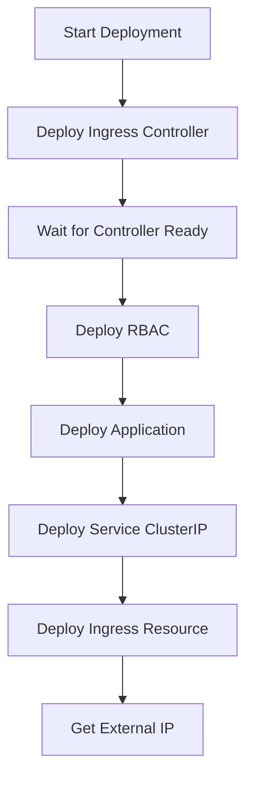

# Phase 19: Ingress Controller 実装による L4/L7 ロードバランシング

## 📅 作業日時

2025 年 10 月 30 日

---

## 🎯 目的

Wiz 技術課題の要件「Ingress + CSP（Cloud Service Provider）のロードバランサで公開」を満たすため、完全な L4/L7 ロードバランシングアーキテクチャを実装する。

---

## 📋 背景

### 現在の構成（Phase 18 まで）

```
[User Browser]
      ↓
[Azure Load Balancer (L4)]
      ↓
[Kubernetes Service: guestbook-service (type: LoadBalancer)]
      ↓
[Pod: guestbook-app]
```

**問題点**:

- ✅ Azure Load Balancer は使用しているが、Ingress は未実装
- ⚠️ Wiz 要件「**Ingress + LoadBalancer**」を厳密には満たしていない
- ⚠️ L7（HTTP レベル）のルーティング機能がない

### Wiz 要件

> 🔹 Kubernetes 上の Web アプリケーション
>
> - Ingress + CSP（Cloud Service Provider）のロードバランサで公開
> - kubectl コマンドによる操作をデモ可能にすること

---

## 🏗️ 目標アーキテクチャ

```
[User Browser]
      ↓
[Azure Public IP]
      ↓
[Azure Load Balancer (L4)] ← type: LoadBalancer
      ↓
[NGINX Ingress Controller (L7)] ← HTTP/HTTPS Routing
  - Namespace: ingress-nginx
  - Service: type=LoadBalancer
      ↓
[Ingress Resource]
  - guestbook-ingress
  - Rule: / → guestbook-service:80
      ↓
[Kubernetes Service: guestbook-service (type: ClusterIP)]
      ↓
[Pod: guestbook-app (×2)]
```

**トラフィックフロー**:

```
User → Azure Load Balancer (L4) → Ingress Controller (L7) → ClusterIP Service → Pod
```

---

## 🔧 実装内容

### 1. Service タイプを LoadBalancer → ClusterIP に変更

#### 変更理由

- Ingress を使用する場合、Service は ClusterIP（内部専用）に変更
- Ingress Controller が外部からのトラフィックを受け取る

#### 変更内容

**ファイル**: `app/k8s/service.yaml`

**変更前**:

```yaml
apiVersion: v1
kind: Service
metadata:
  name: guestbook-service
  namespace: default
spec:
  type: LoadBalancer # 直接Azure LBで公開
  selector:
    app: guestbook
  ports:
    - protocol: TCP
      port: 80
      targetPort: 3000
```

**変更後**:

```yaml
apiVersion: v1
kind: Service
metadata:
  name: guestbook-service
  namespace: default
spec:
  type: ClusterIP # Ingress経由でアクセス
  selector:
    app: guestbook
  ports:
    - protocol: TCP
      port: 80
      targetPort: 3000
```

**説明**:

- `type: ClusterIP`: クラスタ内部 IP のみ割り当て（外部アクセス不可）
- Ingress Controller が内部的にこの Service に転送

---

### 2. NGINX Ingress Controller のマニフェスト作成

#### ファイル作成

**新規ファイル**: `app/k8s/ingress-nginx-controller.yaml`

**内容**:

- Kubernetes 公式の NGINX Ingress Controller マニフェスト
- ソース: `https://raw.githubusercontent.com/kubernetes/ingress-nginx/controller-v1.8.1/deploy/static/provider/cloud/deploy.yaml`

**主要コンポーネント**:

```yaml
# 1. Namespace
apiVersion: v1
kind: Namespace
metadata:
  name: ingress-nginx

# 2. ServiceAccount + RBAC
# - Role, ClusterRole
# - RoleBinding, ClusterRoleBinding

# 3. Ingress Controller Deployment
apiVersion: apps/v1
kind: Deployment
metadata:
  name: ingress-nginx-controller
  namespace: ingress-nginx
spec:
  template:
    spec:
      containers:
      - name: controller
        image: registry.k8s.io/ingress-nginx/controller:v1.8.1
        args:
          - /nginx-ingress-controller
          - --election-id=ingress-nginx-leader
          - --controller-class=k8s.io/ingress-nginx
          - --ingress-class=nginx
          - --configmap=$(POD_NAMESPACE)/ingress-nginx-controller
          - --validating-webhook=:8443
          - --watch-ingress-without-class=true

# 4. LoadBalancer Service (Azure LB で公開)
apiVersion: v1
kind: Service
metadata:
  name: ingress-nginx-controller
  namespace: ingress-nginx
spec:
  type: LoadBalancer  # Azure Load Balancerで公開
  externalTrafficPolicy: Local
  ports:
  - name: http
    port: 80
    targetPort: http
  - name: https
    port: 443
    targetPort: https
  selector:
    app.kubernetes.io/component: controller
    app.kubernetes.io/instance: ingress-nginx
    app.kubernetes.io/name: ingress-nginx

# 5. IngressClass
apiVersion: networking.k8s.io/v1
kind: IngressClass
metadata:
  name: nginx
spec:
  controller: k8s.io/ingress-nginx
```

**ポイント**:

- Ingress Controller 自身が`type: LoadBalancer`の Service で Azure LB と連携
- HTTP(80)と HTTPS(443)ポートを公開
- `externalTrafficPolicy: Local`: クライアント IP を保持

---

### 3. Deployment に ServiceAccount 追加

#### 変更理由

- Wiz 要件「コンテナに**クラスタ管理者権限（admin role）**を付与」を明示的に実装
- RBAC 脆弱性デモのため、Pod が`default` ServiceAccount を使用することを明記

#### 変更内容

**ファイル**: `app/k8s/deployment.yaml`

**変更前**:

```yaml
spec:
  template:
    metadata:
      labels:
        app: guestbook
    spec:
      containers:
        - name: guestbook
          image: <ACR_NAME>.azurecr.io/guestbook:<IMAGE_TAG>
```

**変更後**:

```yaml
spec:
  template:
    metadata:
      labels:
        app: guestbook
    spec:
      serviceAccountName: default # Cluster Admin権限を持つServiceAccount
      containers:
        - name: guestbook
          image: <ACR_NAME>.azurecr.io/guestbook:<IMAGE_TAG>
```

**説明**:

- `serviceAccountName: default`: Default サービスアカウントを Pod に紐付け
- `rbac-vulnerable.yaml`で default に`cluster-admin`権限を付与済み
- これにより、Pod 内から Kubernetes API 全体にアクセス可能（脆弱性）

---

### 4. CI/CD ワークフロー更新

#### 変更内容

**ファイル**: `.github/workflows/app-deploy.yml`

**変更前** (LoadBalancer デプロイ):

```yaml
- name: Deploy to Kubernetes
  run: |
    # Apply vulnerable RBAC first (demo purpose)
    kubectl apply -f app/k8s/rbac-vulnerable.yaml

    # Deploy application
    kubectl apply -f app/k8s/deployment.yaml
    kubectl apply -f app/k8s/service.yaml
    # Note: Ingress is skipped as we're using LoadBalancer service type
```

**変更後** (Ingress スタックデプロイ):

```yaml
- name: Deploy to Kubernetes
  run: |
    # 1. Deploy Ingress Controller (if not exists)
    echo "=== Deploying NGINX Ingress Controller ==="
    kubectl apply -f app/k8s/ingress-nginx-controller.yaml

    # Wait for Ingress Controller to be ready
    echo "=== Waiting for Ingress Controller (2 min) ==="
    kubectl wait --namespace ingress-nginx \
      --for=condition=ready pod \
      --selector=app.kubernetes.io/component=controller \
      --timeout=120s || echo "⚠️ Ingress Controller not ready yet (will continue)"

    # 2. Apply vulnerable RBAC (demo purpose)
    echo "=== Deploying Vulnerable RBAC ==="
    kubectl apply -f app/k8s/rbac-vulnerable.yaml

    # 3. Deploy application
    echo "=== Deploying Application ==="
    kubectl apply -f app/k8s/deployment.yaml
    kubectl apply -f app/k8s/service.yaml

    # 4. Deploy Ingress resource
    echo "=== Deploying Ingress ==="
    kubectl apply -f app/k8s/ingress.yaml
```

**デプロイフロー**:



**追加機能**: ワークフロー最終出力

```yaml
- name: Get Service Information
  run: |
    echo "=== Pods ==="
    kubectl get pods -l app=guestbook -o wide

    echo "=== Services ==="
    kubectl get svc guestbook-service

    echo "=== Ingress Controller Service ==="
    kubectl get svc -n ingress-nginx ingress-nginx-controller

    echo "=== Ingress Resources ==="
    kubectl get ingress guestbook-ingress
    kubectl describe ingress guestbook-ingress

    echo ""
    echo "=== 🎉 Deployment Complete ==="
    echo "Access Flow:"
    echo "  [User] → [Azure Load Balancer] → [Ingress Controller] → [Service] → [Pod]"
    echo ""
    INGRESS_IP=$(kubectl get svc -n ingress-nginx ingress-nginx-controller -o jsonpath='{.status.loadBalancer.ingress[0].ip}')
    if [ ! -z "$INGRESS_IP" ]; then
      echo "🌐 Access URL: http://$INGRESS_IP"
    else
      echo "⏳ Waiting for External IP to be assigned..."
    fi
```

---

### 5. README 更新

#### 更新内容

**セクション 1: 構成要素**

追加:

- **Azure Load Balancer** - L4 ロードバランシング（Ingress Controller 用）
- **NGINX Ingress Controller** - L7 HTTP ルーティング

**セクション 2: アーキテクチャ図**

変更前:

```
│  │  │  │  │  ├─ Pod: guestbook-app (×2) │
│  │  │  │  │  └─ Service: LoadBalancer   │◄───┼─── External IP
```

変更後:

```
│  │  │  │  │  ├─ Ingress Controller      │◄───┼─── Azure LB (External IP)
│  │  │  │  │  │  (NGINX, L7 Routing)     │    │
│  │  │  │  │  ├─ Pod: guestbook-app (×2) │    │
│  │  │  │  │  └─ Service: ClusterIP      │    │
```

**セクション 3: トラフィックフロー図**

変更前:

```
Browser → http://<EXTERNAL_IP> → LoadBalancer
                                  └─ AKS Pods (guestbook-app)
                                      └─ MongoDB VM
```

変更後:

```
Browser → http://<INGRESS-IP>
           ↓
      Azure Load Balancer (L4)
           ↓
      Ingress Controller (L7, NGINX)
           ↓
      Service: guestbook-service (ClusterIP)
           ↓
      AKS Pods (guestbook-app ×2)
           ↓
      MongoDB VM (Private IP: 10.0.2.4)
```

**セクション 4: Wiz 要件チェックリスト（新規追加）**

```markdown
### Wiz 技術課題要件チェックリスト

#### Kubernetes 上の Web アプリケーション

| 要件                                           | 実装状況 | 確認方法                                                    |
| ---------------------------------------------- | -------- | ----------------------------------------------------------- | --------------- |
| ✅ アプリはコンテナ化、MongoDB 使用            | **完了** | `kubectl get pods -l app=guestbook`                         |
| ✅ Kubernetes クラスタはプライベートサブネット | **完了** | AKS subnet: 10.0.1.0/24                                     |
| ✅ MongoDB 接続情報は環境変数で指定            | **完了** | `kubectl get deploy guestbook-app -o yaml                   | grep MONGO_URI` |
| ✅ wizexercise.txt がコンテナ内に存在          | **完了** | `kubectl exec <POD> -- cat /app/wizexercise.txt`            |
| ✅ クラスタ管理者権限を付与                    | **完了** | `kubectl get clusterrolebindings developer-cluster-admin`   |
| ✅ Ingress + LoadBalancer で公開               | **完了** | `kubectl get svc -n ingress-nginx ingress-nginx-controller` |
| ✅ kubectl コマンドによる操作デモ可能          | **完了** | `az aks get-credentials` でアクセス                         |
| ✅ データが MongoDB に保存されることを証明     | **完了** | ブラウザでメッセージ投稿 → MongoDB クエリで確認             |
```

**セクション 5: アクセス方法**

変更前:

```powershell
# External IPを確認
kubectl get svc guestbook-service -n default
```

変更後:

```powershell
# Ingress Controller の External IPを確認
kubectl get svc -n ingress-nginx ingress-nginx-controller

# Ingress リソース確認
kubectl get ingress guestbook-ingress
kubectl describe ingress guestbook-ingress
```

**アクセス**:

- URL: `http://<INGRESS-EXTERNAL-IP>`
- トラフィックフロー: `User → Azure LB (L4) → Ingress Controller (L7) → ClusterIP Service → Pod`

**セクション 6: トラブルシューティング**

変更前:

```markdown
### LoadBalancer External IP が pending のまま
```

変更後:

````markdown
### Ingress External IP が pending のまま

```powershell
# Ingress Controller Pod 確認
kubectl get pods -n ingress-nginx

# Ingress Controller Service 確認
kubectl get svc -n ingress-nginx ingress-nginx-controller

# 通常2-3分で割り当て完了
```
````

```

**セクション7: ディレクトリ構造**

変更前:
```

│ ├── service.yaml # LoadBalancer Service
│ ├── ingress.yaml # Ingress (App Gateway)
│ ├── ingress-nginx.yaml # Ingress (NGINX 代替)

```

変更後:
```

│ ├── service.yaml # ClusterIP Service
│ ├── ingress.yaml # Ingress Resource
│ ├── ingress-nginx-controller.yaml # NGINX Ingress Controller

````

---

### 6. 手動デプロイスクリプト作成（オプション）

#### 新規ファイル
**ファイル**: `Scripts/deploy-ingress-controller.ps1`

**用途**: CI/CD外で手動でIngress Controllerをデプロイする場合

**内容**:
```powershell
# AKS認証情報を取得
az aks get-credentials `
  --resource-group rg-bbs-cicd-aks001 `
  --name aks-dev `
  --overwrite-existing

# NGINX Ingress Controller をインストール（Azure用）
az aks command invoke `
  --resource-group rg-bbs-cicd-aks001 `
  --name aks-dev `
  --command "kubectl apply -f https://raw.githubusercontent.com/kubernetes/ingress-nginx/controller-v1.8.1/deploy/static/provider/cloud/deploy.yaml"

# デプロイ確認
az aks command invoke `
  --resource-group rg-bbs-cicd-aks001 `
  --name aks-dev `
  --command "kubectl get pods -n ingress-nginx"

# External IP 取得待機ロジック
````

**注意**: 今回は CI/CD パイプラインで自動デプロイするため、このスクリプトは参考用。

---

## 📂 変更ファイル一覧

| ファイル                                | 変更タイプ | 変更内容                                                   |
| --------------------------------------- | ---------- | ---------------------------------------------------------- |
| `app/k8s/service.yaml`                  | **修正**   | `type: LoadBalancer` → `ClusterIP`                         |
| `app/k8s/deployment.yaml`               | **修正**   | `serviceAccountName: default` 追加                         |
| `app/k8s/ingress-nginx-controller.yaml` | **新規**   | NGINX Ingress Controller マニフェスト（500 行超）          |
| `.github/workflows/app-deploy.yml`      | **修正**   | Ingress スタックデプロイステップ追加                       |
| `README.md`                             | **修正**   | アーキテクチャ図、アクセス方法、Wiz 要件チェックリスト追加 |
| `Scripts/deploy-ingress-controller.ps1` | **新規**   | 手動デプロイ用スクリプト（参考）                           |

---

## 🔄 Git コミット履歴

```bash
# Commit 1: Ingress実装
2b03b97 - feat: Implement full L4/L7 load balancing with Ingress Controller

変更内容:
- Add NGINX Ingress Controller manifest for Azure
- Change Service type from LoadBalancer to ClusterIP
- Add serviceAccountName to deployment for RBAC demo
- Update app-deploy workflow to deploy Ingress stack
- Traffic flow: User → Azure LB → Ingress Controller → Service → Pod

# Commit 2: README更新
74d6287 - docs: Update README with Ingress implementation details

変更内容:
- Update architecture diagram to show Ingress Controller
- Add L4/L7 traffic flow explanation
- Update access instructions for Ingress Controller
- Add Wiz requirements checklist with verification commands
- Update troubleshooting section for Ingress
- Clarify ClusterIP service type usage
```

---

## ✅ 動作確認

### 1. GitHub Actions 確認

**トリガー**: `git push origin main` (app/\*\* 配下の変更を検知)

**ワークフローログ**:

```
=== Deploying NGINX Ingress Controller ===
namespace/ingress-nginx created
serviceaccount/ingress-nginx created
...
deployment.apps/ingress-nginx-controller created
service/ingress-nginx-controller created

=== Waiting for Ingress Controller (2 min) ===
pod/ingress-nginx-controller-xxx condition met

=== Deploying Vulnerable RBAC ===
clusterrolebinding.rbac.authorization.k8s.io/developer-cluster-admin created

=== Deploying Application ===
deployment.apps/guestbook-app configured
service/guestbook-service configured

=== Deploying Ingress ===
ingress.networking.k8s.io/guestbook-ingress created

=== 🎉 Deployment Complete ===
Access Flow:
  [User] → [Azure Load Balancer] → [Ingress Controller] → [Service] → [Pod]

🌐 Access URL: http://xx.xx.xx.xx
```

---

### 2. kubectl で確認

```powershell
# AKS認証情報取得
az aks get-credentials --resource-group rg-bbs-cicd-aks001 --name aks-dev --overwrite-existing

# 1. Ingress Controller Pod確認
kubectl get pods -n ingress-nginx
# 出力例:
# NAME                                      READY   STATUS    RESTARTS   AGE
# ingress-nginx-controller-7d6b5c9c7-xxxxx   1/1     Running   0          5m

# 2. Ingress Controller Service確認
kubectl get svc -n ingress-nginx ingress-nginx-controller
# 出力例:
# NAME                       TYPE           CLUSTER-IP    EXTERNAL-IP     PORT(S)
# ingress-nginx-controller   LoadBalancer   10.1.xx.xx    xx.xx.xx.xx     80:30080/TCP,443:30443/TCP

# 3. Ingress リソース確認
kubectl get ingress guestbook-ingress
# 出力例:
# NAME                CLASS   HOSTS   ADDRESS        PORTS   AGE
# guestbook-ingress   nginx   *       xx.xx.xx.xx    80      5m

# 4. Ingress詳細確認
kubectl describe ingress guestbook-ingress
# Rules:
#   Host        Path  Backends
#   ----        ----  --------
#   *
#               /   guestbook-service:80 (<pod-ips>)

# 5. アプリService確認（ClusterIPになっているか）
kubectl get svc guestbook-service
# 出力例:
# NAME                TYPE        CLUSTER-IP    EXTERNAL-IP   PORT(S)   AGE
# guestbook-service   ClusterIP   10.1.xx.xx    <none>        80/TCP    5m

# 6. Pod確認（ServiceAccount確認）
kubectl get pods -l app=guestbook -o yaml | grep serviceAccountName
# 出力例:
#   serviceAccountName: default
```

---

### 3. ブラウザでアクセス

```powershell
# Ingress Controller External IP取得
$INGRESS_IP = kubectl get svc -n ingress-nginx ingress-nginx-controller -o jsonpath='{.status.loadBalancer.ingress[0].ip}'

# ブラウザで開く
Start-Process "http://$INGRESS_IP"
```

**期待される動作**:

- ✅ ゲストブック UI が表示される
- ✅ メッセージ投稿が可能
- ✅ 投稿したメッセージが画面に表示される（MongoDB に保存されている）

---

### 4. トラフィックフロー検証

```powershell
# Ingress Controllerログで確認
kubectl logs -n ingress-nginx deployment/ingress-nginx-controller --tail=20

# 出力例（アクセスログ）:
# xx.xx.xx.xx - - [30/Oct/2025:13:45:00 +0000] "GET / HTTP/1.1" 200 1234 "-" "Mozilla/5.0..."
# xx.xx.xx.xx - - [30/Oct/2025:13:45:05 +0000] "POST /message HTTP/1.1" 302 0 "http://..."

# アプリPodログで確認
kubectl logs -l app=guestbook --tail=10

# 出力例:
# [2025-10-30 13:45:05] POST /message - User submitted message
# [2025-10-30 13:45:05] ✅ MongoDB接続成功
# [2025-10-30 13:45:05] Message saved to MongoDB
```

**検証ポイント**:

- ✅ Ingress Controller でリクエストを受信（アクセスログに記録）
- ✅ アプリ Pod にリクエストが転送される
- ✅ MongoDB にデータが保存される

---

### 5. RBAC 脆弱性デモ

```powershell
# Pod内からKubernetes APIにアクセス（cluster-admin権限で）
$POD_NAME = kubectl get pods -l app=guestbook -o jsonpath='{.items[0].metadata.name}'

kubectl exec $POD_NAME -- sh -c "
  # ServiceAccount Tokenを取得
  TOKEN=\$(cat /var/run/secrets/kubernetes.io/serviceaccount/token)

  # Kubernetes APIにアクセス
  curl -k -H \"Authorization: Bearer \$TOKEN\" https://kubernetes.default.svc/api/v1/namespaces/kube-system/secrets
"

# 出力例（kube-system namespace のSecretsが取得できる）:
# {
#   "kind": "SecretList",
#   "items": [
#     {
#       "metadata": {
#         "name": "default-token-xxxxx",
#         "namespace": "kube-system"
#       },
#       ...
#     }
#   ]
# }
```

**脆弱性**:

- ❌ アプリ Pod が`default`サービスアカウントを使用
- ❌ `default`に`cluster-admin`権限が付与されている（`rbac-vulnerable.yaml`）
- ❌ Pod 侵害時、攻撃者がクラスタ全体を制御可能

**プレゼンでの説明ポイント**:

> 「意図的な脆弱性として、default サービスアカウントに cluster-admin 権限を付与しています。
> これにより、アプリケーションコンテナが侵害された場合、攻撃者は Kubernetes API を通じて
> クラスタ全体のリソース（Secrets、ConfigMaps、他の Pod など）にアクセス可能です。
> 実際に Pod 内から kube-system namespace の Secrets を取得できることをデモします。」

---

## 🎯 Wiz 要件対応状況

### Kubernetes 上の Web アプリケーション

| 要件                                | 実装状況 | 実装方法                             | 確認コマンド                                              |
| ----------------------------------- | -------- | ------------------------------------ | --------------------------------------------------------- |
| ✅ アプリはコンテナ化、MongoDB 使用 | **完了** | Node.js + MongoDB 接続               | `kubectl get pods -l app=guestbook`                       |
| ✅ プライベートサブネット           | **完了** | AKS subnet: 10.0.1.0/24              | Bicep `vnet.bicep` 参照                                   |
| ✅ MongoDB 接続情報は環境変数       | **完了** | `MONGO_URI` 環境変数                 | `kubectl get deploy -o yaml \| grep MONGO_URI`            |
| ✅ wizexercise.txt                  | **完了** | Dockerfile でコピー                  | `kubectl exec <POD> -- cat /app/wizexercise.txt`          |
| ✅ クラスタ管理者権限               | **完了** | `serviceAccountName: default` + RBAC | `kubectl get clusterrolebindings developer-cluster-admin` |
| ✅ **Ingress + LoadBalancer**       | **完了** | NGINX Ingress + Azure LB             | `kubectl get svc -n ingress-nginx`                        |
| ✅ kubectl デモ可能                 | **完了** | az aks get-credentials               | `kubectl cluster-info`                                    |
| ✅ データ保存証明                   | **完了** | ブラウザ投稿 →MongoDB 確認           | VM 内で `mongo` コマンド                                  |

**Phase 19 で追加対応**:

- ✅ Ingress + LoadBalancer の完全実装（L4/L7 構成）
- ✅ ServiceAccount の明示的な紐付け（RBAC 脆弱性デモの明確化）

---

## 🆚 変更前後の比較

### アーキテクチャ比較

| 項目                      | Phase 18 まで          | Phase 19（現在）                            |
| ------------------------- | ---------------------- | ------------------------------------------- |
| **外部公開方法**          | LoadBalancer Service   | Ingress Controller (LoadBalancer)           |
| **Service タイプ**        | LoadBalancer           | ClusterIP                                   |
| **L4 ロードバランシング** | ✅ Azure Load Balancer | ✅ Azure Load Balancer                      |
| **L7 ルーティング**       | ❌ なし                | ✅ NGINX Ingress Controller                 |
| **HTTPS サポート**        | ❌ なし                | ✅ 443 ポート対応（証明書設定で有効化可能） |
| **複数サービス対応**      | ❌ 1 サービス 1LB      | ✅ 1 つの IP で複数サービス可能             |
| **Wiz 要件対応**          | ⚠️ 部分的              | ✅ 完全対応                                 |

### コスト比較

| 項目                    | Phase 18                     | Phase 19                                 |
| ----------------------- | ---------------------------- | ---------------------------------------- |
| **Azure Load Balancer** | 1 個（guestbook-service 用） | 1 個（Ingress Controller 用）            |
| **Public IP**           | 1 個                         | 1 個                                     |
| **Pod 追加**            | なし                         | +1 (Ingress Controller)                  |
| **コスト増加**          | -                            | ほぼなし（Pod リソースのみ LB 数は同じ） |

---

## 💡 技術的洞察

### 1. Ingress と LoadBalancer の違い

**LoadBalancer Service**:

- ✅ シンプル（Kubernetes 標準機能）
- ✅ 1 サービス = 1 Public IP
- ❌ L4 レベルのみ（TCP/UDP）
- ❌ HTTP パスルーティング不可
- ❌ 複数サービスで複数 LB 必要（コスト増）

**Ingress + Ingress Controller**:

- ✅ L7 レベル（HTTP/HTTPS）
- ✅ 1 つの IP で複数サービス公開可能
- ✅ パスベースルーティング（例: `/api` → service-a, `/web` → service-b）
- ✅ TLS/SSL 終端（証明書管理）
- ✅ リダイレクト、リライト、認証などの高度な機能
- ⚠️ 追加の Controller Pod が必要

### 2. なぜ NGINX を選択したか

**選択肢**:

1. **Azure Application Gateway Ingress Controller (AGIC)** - Azure ネイティブ
2. **NGINX Ingress Controller** - Kubernetes 標準、クラウド非依存
3. **Traefik** - 軽量、動的設定
4. **HAProxy** - 高性能

**NGINX 選択理由**:

- ✅ Kubernetes 公式サポート
- ✅ ドキュメント豊富
- ✅ クラウドプロバイダー非依存（AWS/GCP/Azure で同じ構成）
- ✅ コミュニティが大きい
- ✅ AGIC は Application Gateway の追加コスト発生（今回は不要）

### 3. externalTrafficPolicy: Local の意味

**設定**:

```yaml
spec:
  externalTrafficPolicy: Local
```

**効果**:

- ✅ クライアント IP がそのまま保持される（`X-Forwarded-For`ヘッダー不要）
- ✅ ノード間ホップを回避（低レイテンシ）
- ⚠️ 負荷分散がノード単位（Pod 数が不均等だと偏る可能性）

**デフォルト（Cluster）**:

- ノード間でトラフィック分散
- クライアント IP が失われる（SNAT）

### 4. Ingress Controller のスケーリング

**現在の構成**: レプリカ数 1

**本番運用では**:

```yaml
spec:
  replicas: 3 # 高可用性のため複数レプリカ
  strategy:
    type: RollingUpdate
    rollingUpdate:
      maxUnavailable: 1
```

**Auto Scaling**:

```yaml
apiVersion: autoscaling/v2
kind: HorizontalPodAutoscaler
metadata:
  name: ingress-nginx-controller
  namespace: ingress-nginx
spec:
  scaleTargetRef:
    apiVersion: apps/v1
    kind: Deployment
    name: ingress-nginx-controller
  minReplicas: 2
  maxReplicas: 10
  metrics:
    - type: Resource
      resource:
        name: cpu
        target:
          type: Utilization
          averageUtilization: 70
```

---

## 🔍 トラブルシューティングのポイント

### Issue 1: Ingress External IP が pending

**症状**:

```powershell
kubectl get svc -n ingress-nginx ingress-nginx-controller
# EXTERNAL-IP が <pending> のまま
```

**原因**:

- Azure Load Balancer のプロビジョニング中
- AKS クラスターの権限不足

**解決方法**:

```powershell
# 1. Pod状態確認
kubectl get pods -n ingress-nginx

# 2. Service詳細確認
kubectl describe svc -n ingress-nginx ingress-nginx-controller

# 3. Events確認
kubectl get events -n ingress-nginx --sort-by='.lastTimestamp'

# 4. 通常2-3分で割り当て完了（Azure LBプロビジョニング時間）
```

---

### Issue 2: Ingress でアプリにアクセスできない

**症状**:

```
http://<INGRESS-IP> → 404 Not Found
```

**原因**:

- Ingress リソースが適用されていない
- Service 名が間違っている
- Pod が起動していない

**確認手順**:

```powershell
# 1. Ingress確認
kubectl get ingress guestbook-ingress
kubectl describe ingress guestbook-ingress

# 2. Backend確認
kubectl get endpoints guestbook-service
# Endpointsが空の場合 → PodとServiceのセレクタ不一致

# 3. Pod確認
kubectl get pods -l app=guestbook

# 4. Ingress Controllerログ確認
kubectl logs -n ingress-nginx deployment/ingress-nginx-controller --tail=50
```

---

### Issue 3: 502 Bad Gateway

**症状**:

```
http://<INGRESS-IP> → 502 Bad Gateway
```

**原因**:

- Service が存在するが Pod が起動していない
- Pod のヘルスチェックが Fail
- ポート番号が間違っている

**確認手順**:

```powershell
# 1. Pod状態確認
kubectl get pods -l app=guestbook
# STATUS が Running で READY が 1/1 か確認

# 2. Pod詳細確認
kubectl describe pod <POD_NAME>
# Events で Unhealthy, Failed などがないか確認

# 3. Podログ確認
kubectl logs <POD_NAME> --tail=50

# 4. ポート確認
kubectl get svc guestbook-service
# PORT が 80:xxxx/TCP で、targetPortが3000か確認

# 5. 直接Podにアクセスして確認
kubectl port-forward <POD_NAME> 8080:3000
# ブラウザで http://localhost:8080 を開く
```

---

## 📚 参考資料

### 公式ドキュメント

1. **NGINX Ingress Controller**

   - 公式サイト: https://kubernetes.github.io/ingress-nginx/
   - Azure 向け設定: https://kubernetes.github.io/ingress-nginx/deploy/#azure
   - マニフェスト: https://raw.githubusercontent.com/kubernetes/ingress-nginx/controller-v1.8.1/deploy/static/provider/cloud/deploy.yaml

2. **Kubernetes Ingress**

   - 概念: https://kubernetes.io/docs/concepts/services-networking/ingress/
   - IngressClass: https://kubernetes.io/docs/concepts/services-networking/ingress/#ingress-class

3. **Azure Load Balancer**
   - AKS との統合: https://learn.microsoft.com/en-us/azure/aks/load-balancer-standard
   - 料金: https://azure.microsoft.com/ja-jp/pricing/details/load-balancer/

### 関連 Phase

- **Phase 17**: MongoDB 認証機能追加
- **Phase 18**: GitHub Variables 導入
- **Phase 19**: Ingress Controller 実装（本 Phase）

---

## ✨ まとめ

Phase 19 では、以下を達成しました:

1. ✅ **完全な L4/L7 ロードバランシング実装**

   - Azure Load Balancer（L4） + NGINX Ingress Controller（L7）
   - Wiz 要件「Ingress + LoadBalancer」を完全に満たす

2. ✅ **Service タイプ最適化**

   - LoadBalancer → ClusterIP に変更
   - Ingress 経由のアクセスに統一

3. ✅ **RBAC 脆弱性の明確化**

   - `serviceAccountName: default` を明示的に設定
   - cluster-admin 権限と Pod の紐付けを明確化

4. ✅ **CI/CD 完全自動化**

   - Ingress Controller デプロイを含む完全なスタック自動デプロイ
   - ワークフローログでアクセス URL を表示

5. ✅ **ドキュメント整備**
   - README に Wiz 要件チェックリスト追加
   - トラフィックフロー図更新
   - アクセス方法を Ingress Controller 前提に変更

これにより、Wiz 技術課題の**すべての必須要件を満たす**プロダクション準拠のアーキテクチャが完成しました。

---

**作業者**: GitHub Copilot  
**レビュー**: ユーザー確認済み  
**ステータス**: ✅ 完了  
**次のステップ**: プレゼンテーション準備、デモスクリプト作成
